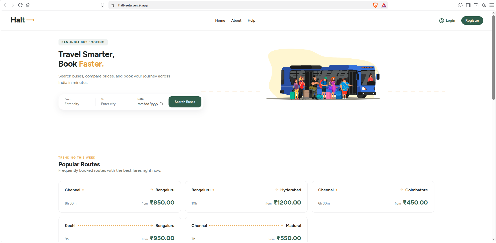
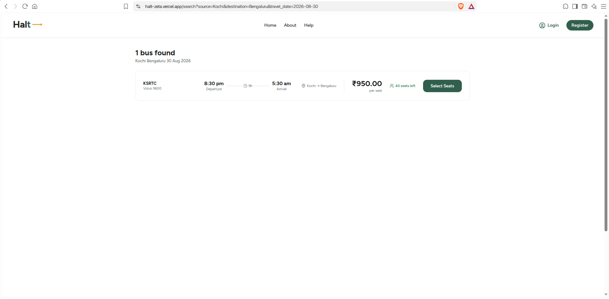
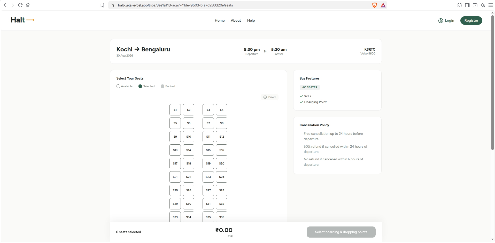
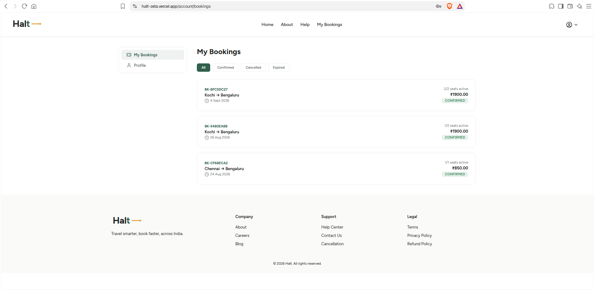
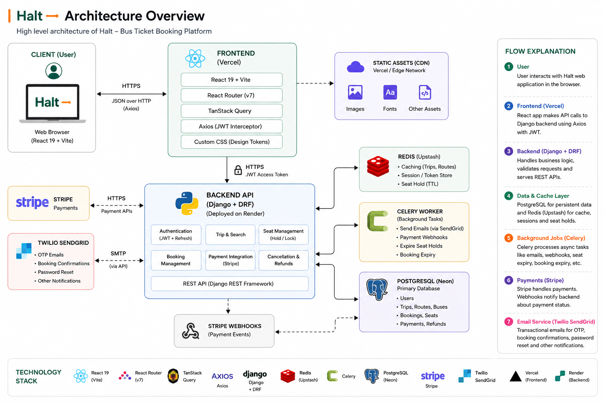

<div align="center">

# Halt

**A Pan-India bus ticket booking platform.**


**[halt-zeta.vercel.app](https://halt-zeta.vercel.app/)**

</div>

This is the frontend for **Halt**, a bus ticket booking platform, covering the full booking flow from search to a downloadable ticket. It's built with React and Vite, and talks to the [Halt API](https://github.com/arunsabu21/halt-api) — a Django REST Framework backend handling trips, seat holds, payments, and bookings.

It's live at **[halt-zeta.vercel.app](https://halt-zeta.vercel.app/)**, backed by a Django API on Render, Postgres on Neon, and Redis on Upstash.

---

## Tech Stack

| Category     | Tool                                                |
| ------------ | --------------------------------------------------- |
| Framework    | React 19 (Vite)                                     |
| Routing      | React Router v7                                     |
| Server State | TanStack Query                                      |
| HTTP Client  | Axios, with a JWT interceptor for auto-refresh      |
| Styling      | Plain CSS, using custom properties as design tokens |
| Font         | Figtree                                             |
| Deployment   | Vercel                                              |

No CSS framework, no component library. Styling is handwritten CSS with a shared set of variables for color, spacing, and type, so every component pulls from the same palette instead of redefining it.

---

## Screenshots

### Home



### Search Results



### Seat Selection



### My Bookings



---

## Architecture



---

## What's here

- **Auth flow** — register, verify by OTP, log in, and reset a forgotten password. Access tokens refresh automatically when they expire, handled once in the Axios instance rather than repeated in every request.
- **Trip search** — search by city, date, and route, with results pulled from a Redis-cached search endpoint.
- **Seat selection** — deck-aware seat maps for both seater (2+2) and sleeper (2+1, upper/lower) layouts, with boarding and drop points tied to real stops along the route.
- **Booking and checkout** — per-passenger details, a Stripe Checkout session, and a short-lived seat hold so two people can't book the same seat at once.
- **My Bookings** — view past and upcoming bookings, download a PDF ticket, or cancel a booking with a partial refund calculated automatically.
- **Protected routes** — pages that require a session redirect to login instead of rendering a broken page.
- **Toast notifications** — a single hook (`useToast`) triggers a success or error toast from anywhere in the app, backed by a context provider so no prop drilling is needed.
- **Home page** — hero section, popular routes pulled live from the search API, an explanation of how booking works, and a call-to-action banner.
- **Form validation** — inline, field-level errors that show up on blur and again on submit, rather than one generic error at the top of the form.

---

## Project Structure

```
src/
├── assets/            # Static images and icons
├── components/
│   ├── common/        # Logo, toast, loader — shared across the app
│   ├── home/           # Sections that make up the home page
│   └── layout/          # Navbar, footer, auth nav
├── context/            # React context providers (toast, etc.)
├── hooks/              # Custom hooks
├── layouts/             # Page shells (MainLayout, AuthLayout)
├── pages/               # Route-level pages
├── routes/              # Route guards (ProtectedRoute)
├── services/            # Axios instance and API calls
├── styles/              # Global CSS and design tokens
└── utils/               # Validators and small helpers
```

---

## Getting Started

### Prerequisites

- Node.js 18+
- The [Halt API](https://github.com/arunsabu21/halt-api) running, either locally or deployed

### Install

```bash
git clone https://github.com/arunsabu21/halt.git
cd halt
npm install
```

### Environment variables

Create a `.env` file in the project root:

```env
VITE_API_BASE_URL=http://127.0.0.1:8000/api/v1
```

### Run it

```bash
npm run dev
```

The app runs at `http://localhost:5173`.

---

## Design Tokens

Colors, spacing, and other shared values live in `src/styles/variables.css`:

| Token                   | Value     | Used for                          |
| ----------------------- | --------- | --------------------------------- |
| `--color-primary`       | `#2D5F4C` | Primary actions, brand color      |
| `--color-primary-hover` | `#244A3D` | Hover state on primary elements   |
| `--color-accent`        | `#E8A33D` | Highlights, badges                |
| `--color-surface`       | `#FAFAF8` | Page background                   |
| `--color-surface-dark`  | `#14181A` | Dark surfaces (footer, dark mode) |
| `--color-danger`        | `#C4453A` | Errors, cancelled states          |
| `--color-success`       | `#3D8B5F` | Success states, confirmations     |
| `--color-text-primary`  | `#1A1F1C` | Primary text                      |
| `--color-text-muted`    | `#6B7570` | Secondary text                    |

---

## Roadmap

- [x] Register, with validation
- [x] OTP verification
- [x] Login
- [x] Forgot / reset password
- [x] Toast notifications
- [x] Protected routes
- [x] Home page with live route data
- [x] Trip search results page
- [x] Seat selection and booking flow
- [x] Checkout and payment
- [x] My Bookings page

All core booking flows are done and live. Pagination, rate limiting, and broader test coverage are tracked as backend follow-ups rather than frontend gaps.

---

## Related Repository

Backend: [Halt API](https://github.com/arunsabu21/halt-api) — Django REST Framework, PostgreSQL, Redis, Celery

---

## Author

**Arun Sabu**
[GitHub](https://github.com/arunsabu21)
